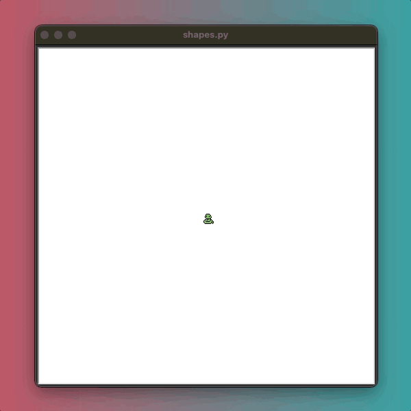
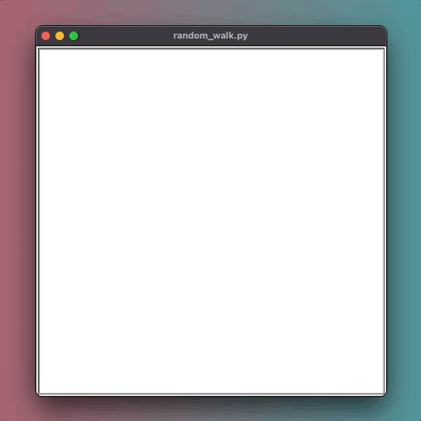
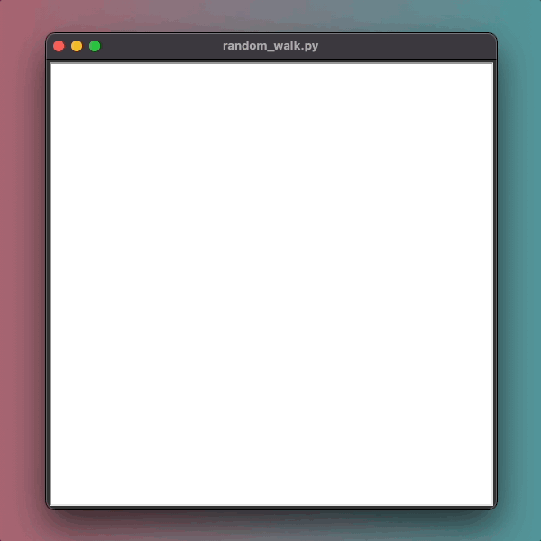
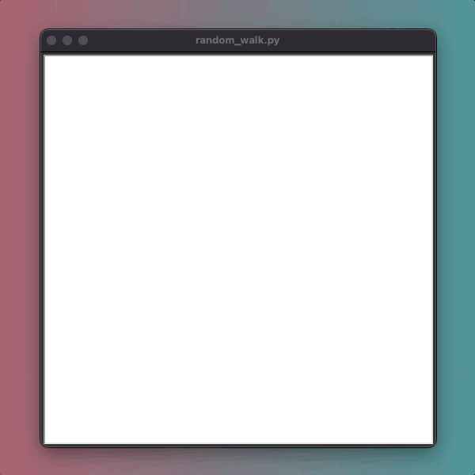
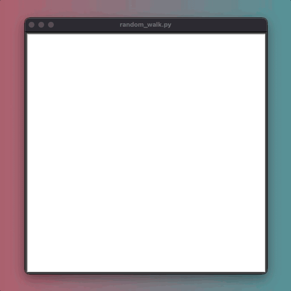
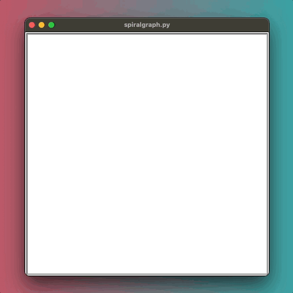
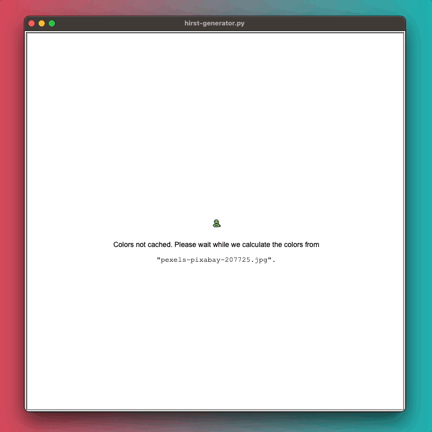

# Python 100 Days of Code

## Day 18: Turtle Graphics

In Day 18, I explored Turtle Graphics in Python, creating various visual elements through code. Below are the projects
I've completed:

### Files:

| **[shapes.py](src/shapes.py)** - A program that draws different geometric shapes with varying colors. |
|:-----------------------------------------------------------------------------------------------------:|
|                                                                   |

 
 

| **[random_walk.py](src/random_walk.py)** - A program that demonstrates the stochastic process, known as a "Random Walk", which describes a path that consists of a succession of random steps on some mathematical space [^1]. |
|:------------------------------------------------------------------------------------------------------------------------------------------------------------------------------------------------------------------------------:|
|                                                                                                                                                                                     
|                                                                                                                                                                                     
|                                                                                                                                                                                     
|                                                                                                                                                                                     |

 
 

| **[spiralgraph.py](src/spiralgraph.py)** - A program that draws a spiralgraph in varying colors with a given number of circles. |
|:-------------------------------------------------------------------------------------------------------------------------------:|
|                                                                                        |

 
 

| **[hirst-generator.py](src/hirst-generator.py)** - A program that draws generates a color palette from an image, then draws a matrix of dots similar to a Damien Hirst art piece. I went above and beyond what was asked for this project. My version loads the color palette from a JSON file. If the JSON file doesn't exits, it will show a loading screen while it generates the palette from a given file. 
|:---------------------------------------------------------------------------------------------------------------------------------------------------------------------------------------------------------------------------------------------------------------------------------------------------------------------------------------------------------------------------------------------------------------:|
|                                                                                                                                                                                                                                                                                                                                                                    |

---

[^1]: https://en.wikipedia.org/wiki/Random_walk

*This repository will be continuously updated as I progress through the 100 Days of Code challenge.*
